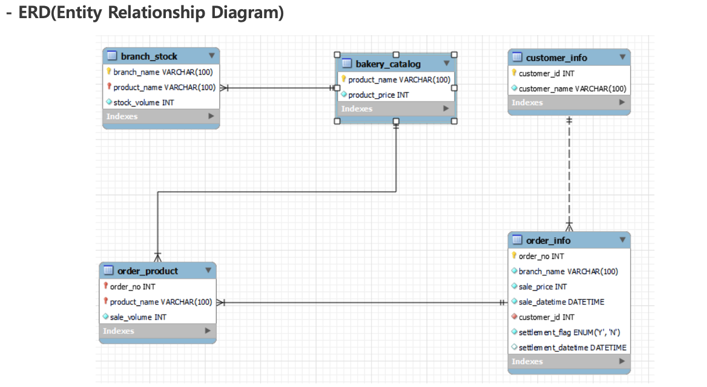
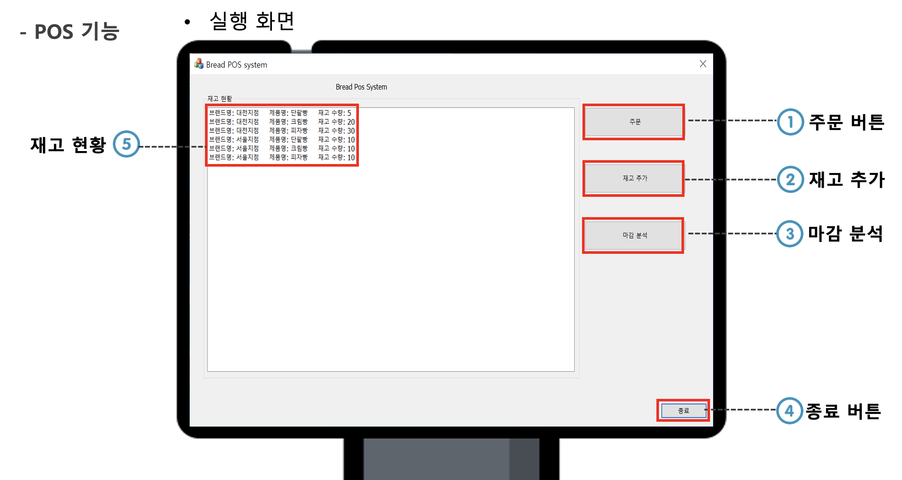
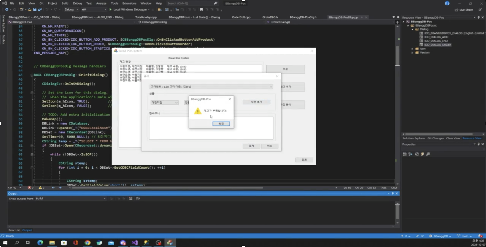

## ✔️ Bakery Pos

: 빵집 포스 프로그램 구현

- 개요 : 빵집 DB 모델링 및 pos 프로그램 구현
- 사용 기술 : MySQL
- 관련 교과목 : 데이터베이스
- 역할 : DB 모델링 및 pos 프로그램 구조 설계
- 기간 : 2022년 10월 31일 - 2022년 11월 20일

▶︎ DB Modeling

▶︎ POS 프로그램 실행 모습

